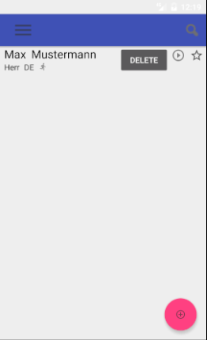
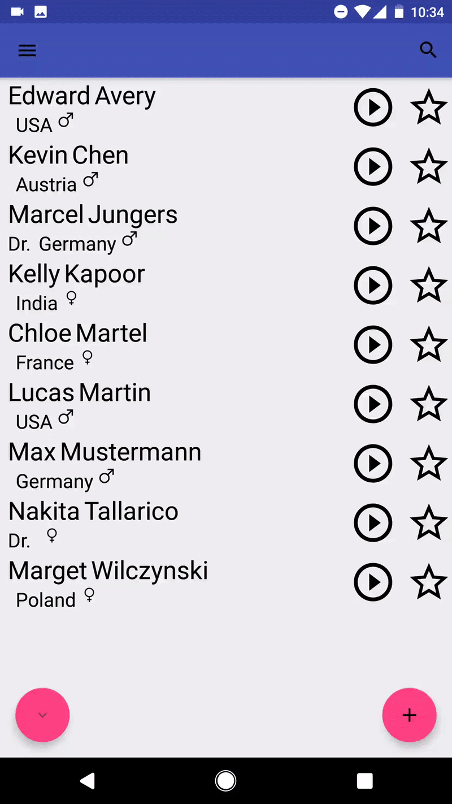
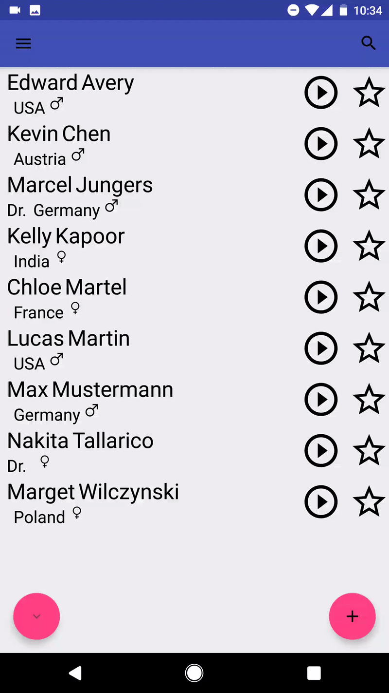
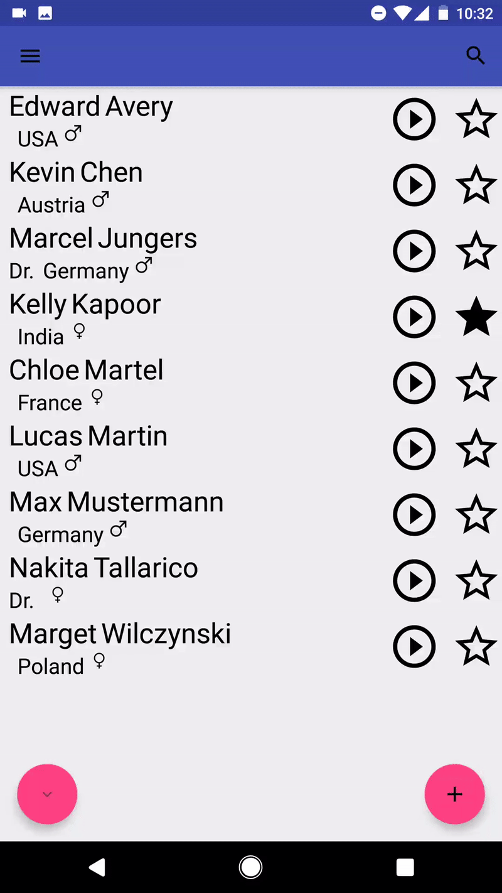
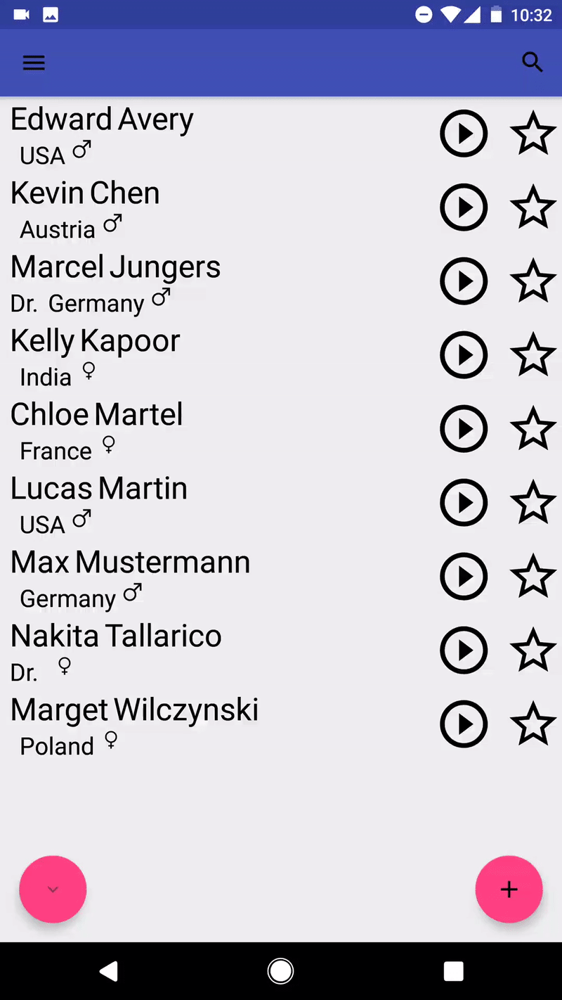
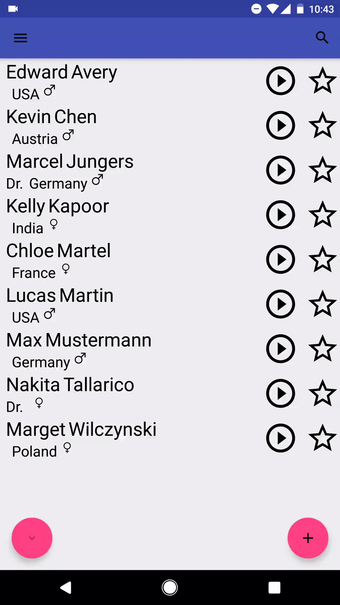

# Prono 

Die Appliatkon 'Prono' ermöglicht das Verwalten von Kontakten, jedoch gibt es einen Bonus, um folgendes Problem möglichst zu vermeiden:

 Namen verwenden oft die gleichen Buchstaben, oft auch in der selben Reihenfolge. Jedoch sieht die phonetische Schreibweise eines Namens sehr unterschiedlich aus, auch wenn die normale Schreibweise identisch ist. Oft kommt dies vor, wenn es eine unterschiedliche Herkunft der Person gibt. 
 In einem professionellen Umfeld ist der erste Eindruck wichtig, und wenn der Name falsch ausgesprochen wird ist das oft schon ein sehr schlechter Start.

Um diesem schlechten Start vorzubeugen, erlaubt 'Prono' es dem Nutzer für einen Kontakt eine Aussprache aufzunehmen. 
Dadurch kann der Nutzer bereits von einer vorigen Erfahrung auf den Kontakt zurückkommen, und ein Wiederholen vermeiden.
Oder ein Kollege hat bereits die selbe Erfahrung gemacht, und kann dem Vertriebler vor der Reise den Tipp geben und ihn mit den richtigen Informationen auf den Weg schicken.

## Features

 - ### Hinzufügen eines neuen Kontaktes:

 	 Ein neuer Kontakt kann leicht über den 'Add'-Button hinzugefügt werden
 	  
 	 

 - ### Bearbeiten eines Kontaktes:

 	 Die Informationen, sowie die Aussprache, eines Kontaktes können bearbeitet werden 
 	 

 - ### Löschen eines Kontaktes:

 	 Ein Kontakt kann gelöscht (und kurzzeitig notfalls wieder hergestellt) werden

 - ### Durchsuchen der Kontakte:

 	 Die Kontakte können über die Such-Funktion durchsucht werden
	  
	 

 - ### Filtern/Sortieren der Kontakte über den 'Filter'-Button:

 	 Die angezeigten Kontakte können gefiltert (Land/Geschlecht) und sortiert (Vor-/Nachname) werden 

 - ### Favoriten für eine schnelle Übersicht verwalten:

 	 Um häufig verwendete Kontakte schnell verfügbar zu haben, können diese als Favoriten markiert werden und leicht über die 'Favoriten' aufgerufen werden
 	  
 	 

 - ### 'Undo' einer Aktion (Löschen/Editieren):

 	 Ausversehen einen Kontakt gelöscht/überschrieben? Für eine kurze Zeit lässt er sich wieder herstellen!
 	   
 	 

 - ### Dateien exportieren, um sie später wieder importieren zu können (ebenfalls: Daten zurücksetzen):

 	 Gerät zurücksetzen? Daten auf ein anderes Gerät verschieben? Alle Daten zurücksetzen? Klar.
 	 
 	 _Benutzung auf eigene Gefahr, alle Daten können verloren gehen_ 
 	 

## Installation
Wenn das Android Gerät bereits Erlaubnis zur Installation von Unbekannten Quellen hat, wird die App mit der [pronoApp.apk-Datei](pronoApp.apk) automatisch installiert.
Sollte die Berechtigung noch nötig sein:
	1. Öffne Einstellungen/Sicherheit
	2. Aktiviere 'Unbekannte Quellen'
	3. Installiere App mit [pronoApp.apk](pronoApp.apk)

## Verwendung der App

### Erstellung eines Kontaktes 

Um einen Kontakt zu erstellen klickt der User auf den 'Add'-Button (+) rechts unten. 
Mit dem 'Record'-Button (mittig unten) lässt sich eine Aussprache aufnehmen (die Aufnahme lässt sich durch eine erneute Aufnahme auch überschreiben). 
In den Textfeldern lassen sich sonstige Informationen eingeben.
Die Mindestanforderungen zur Erstellung des Kontaktes sind ein nicht-leerer Nachname, sowie eine Aufnahme der Aussprache. 
Ohne diese wird der Kontakt nicht erstellt.

### Aufrufen eines Kontaktes 

Um einen Kontakt zu finden gibt es mehrere Möglichkeiten:

1. Suche
	 Mit der Suchfunktion (Lupe rechts oben) lassen sich die Kontakte schnell durchsuchen.

2. Filtern
	 Mit der Filterfunktion (Button links unten) lassen sich die angezeigten Kontakte eingrezen, um eventuell nur Kontakte aus einem Land angezeigt zu bekommen.
	 Weiterhin lässt sich hier die Reihenfolge anpassen (Vor-/Nachname auf- bzw. absteigend).

3. Favoriten
	 Mit dem 'Stern' lassen sich Kontakte als Favoriten markieren. Favoriten lassen sich dann später schnell über das Menü (rechts-swipe bzw. Menü-Icon links oben) 'Favoriten' aufrufen.

### Bearbeiten eines Kontaktes

Um einen Kontakt zu Bearbeiten folgt man diesen Schritten:

 1. Kontakt öffnen

  In der Liste den Kontakt suchen und ihn durch einen Klick öffnen

 2. Editor öffnen

  Auf den 'Editier'-Button rechts unten klicken

 3. Informationen eingeben

  Gewünschte Informationen eingeben, evtl. Aufnahme aufnehmen

 4. Bestätigen

  In dem Editor über den 'Bestätigen'-Button rechts unten bestätigen und den Kontakt speichern

## Enwicklungsgeschichte

[Changelog](CHANGELOG.md)

## Lizenz

Apache License, Version 2.0