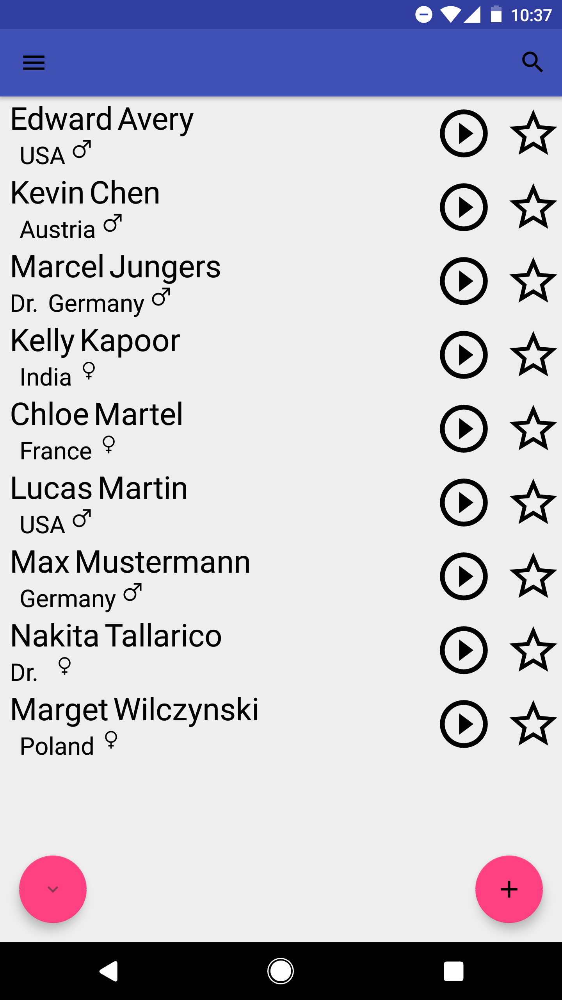

# Prono 

Screenshot of the home screen

Kurze Beschreibung der App inklusive der Beschreibung des Problems, welches durch die App gelöst wird. Hier wäre auch ein Screenshot oder Logo zu platzieren.

Die folgende Applikation, "Prono", ermöglicht das Verwalten von Kontakten mit einem kleinen Bonus, die Aussprache eines Kontakts zu speichern und abzurufen.
Besonders profitabel ist die Applikation für Menschen die bei ihrer Tätitgeit, ob Privat, Hobby oder Beruf, Konktakt mit vielen Menschen anderer Nationen und ihrer außergeöhnlicher Namen pflegen. Besteht dazu das Interesse die richtige Aussprache der Namen nicht zu vergessen, bietet die Applikation dem Nutzer zu einem Kontakt mit seinen üblichen Informationen, ebenfalls eine Audiodatei mit einer Aussprache des Namens aufzunehmen, die jederzeit Abrufbar ist.

## Installation
Falls das Android Gerät die Erlaubnis zu Unbekannten Quellen hat, dann wird Prono beim Öffnen automatisch installiert.
Falls das Gerät noch keine Erlaubnis hat, führe folgende Schritte aus:
Öffne Einstellungen/Sicherheit -> aktiviere Unbekannte Quellen -> öffne Prono

## Verwendung der App

### Wichtiger Anwendungsfall 1
Man hat ein wichtiges berufliches Meeting in einer internationalen Runde. Benutze die App, um dir z.B. die richtige Aussprache der Vorstandsmitglieder anzueignen, um einer Blamage zu hintergehen.

### Wichtiger Anwendungsfall 2
Die Verlobte hat einem ihren Vater mit seinem schweren Namen bisher nur einmal vorgestellt. Sonst, falls sie ihn im Alltag erwähnt, verwendet sie das Wort "Dad" anstatt des richtigen Namens, weshalb man sich nie dessen richtige Aussprache merken konnte.Man benutzt Prono, um die Familie beim nächsten Treffen mit der richtigen Aussprache des Zungenbrechers zu begeistern.

### Wichtiger Anwendungsfall 3
Man zieht in ein anderes Land um. Benutze die App, um den Ansturm neuer Namen besser und schneller zu erlernen. 

## Enwicklungsgeschichte

[Changelog](CHANGELOG.md)

## Lizenz

Apache License, Version 2.0