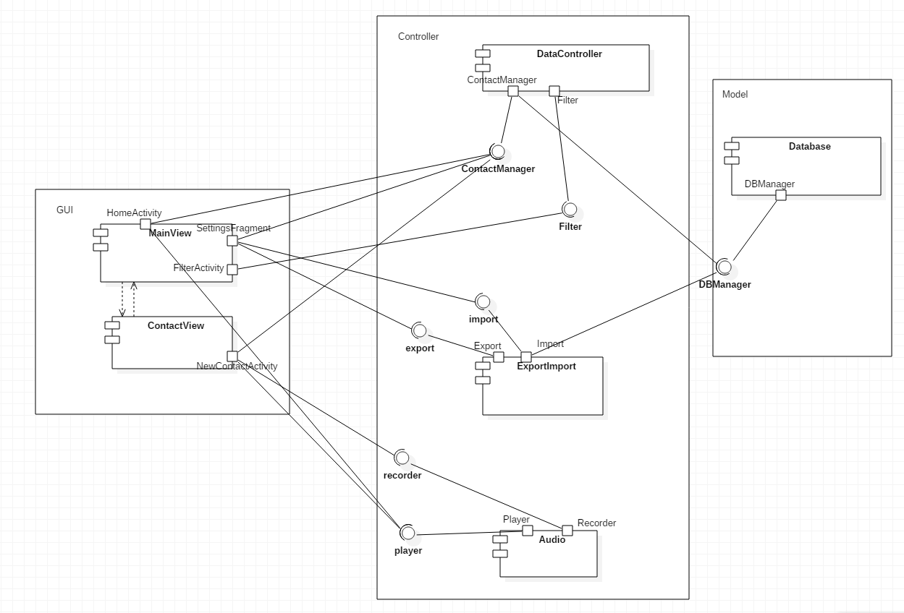
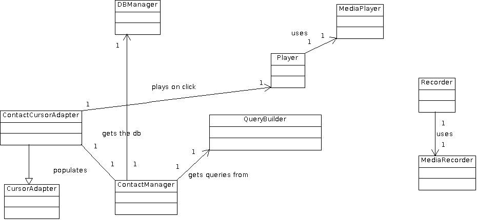
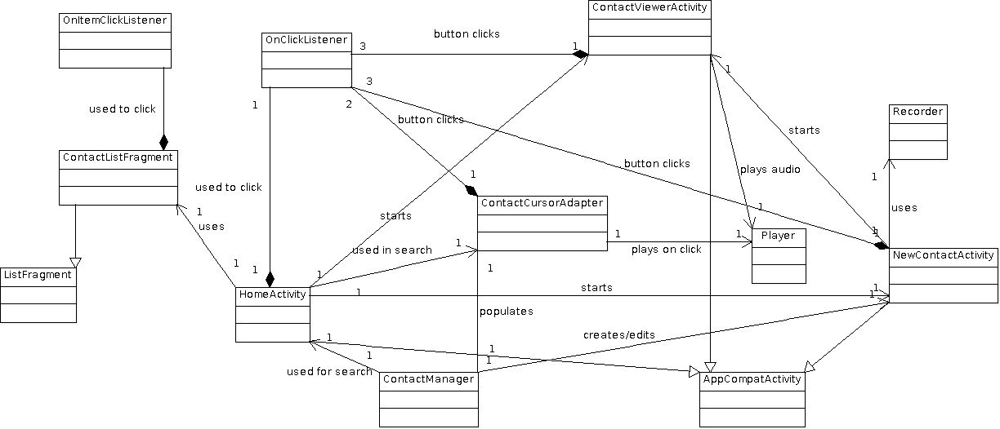
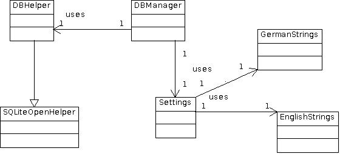
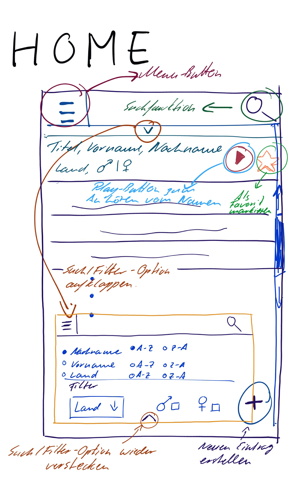
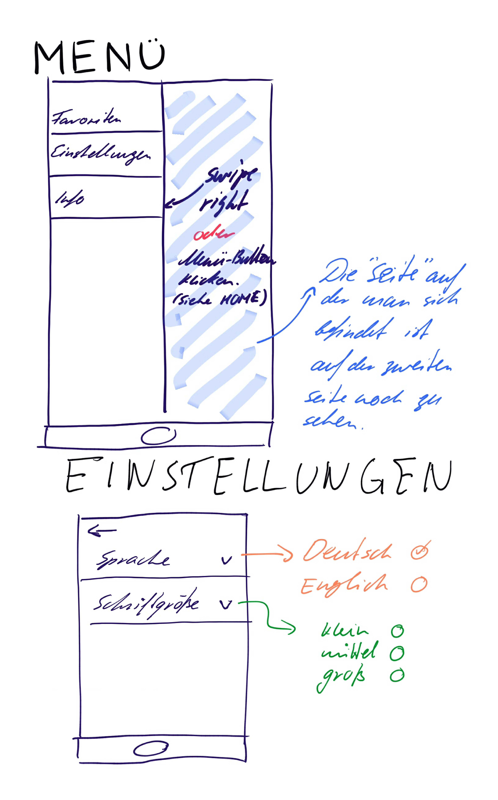
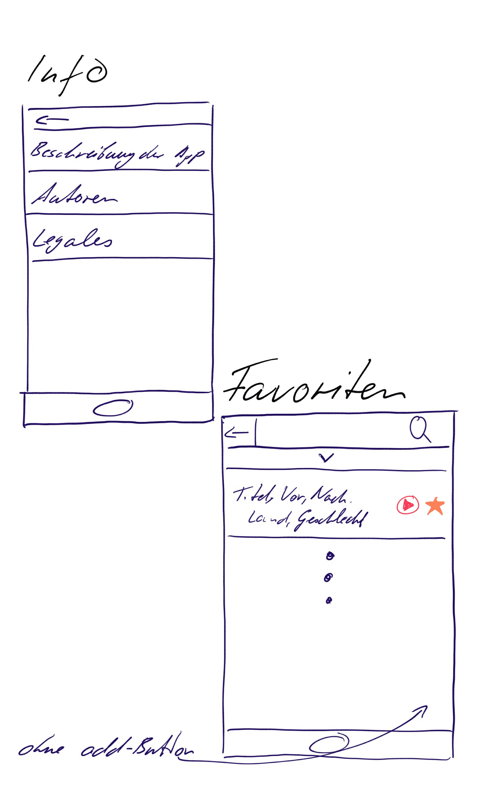
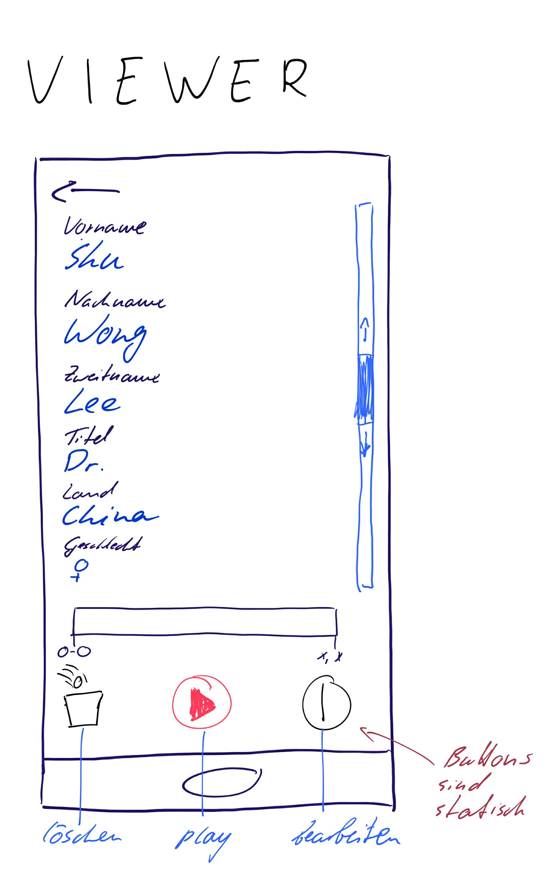
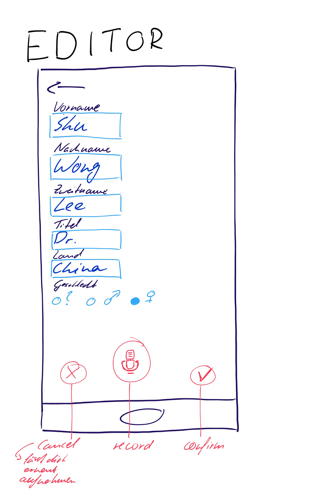
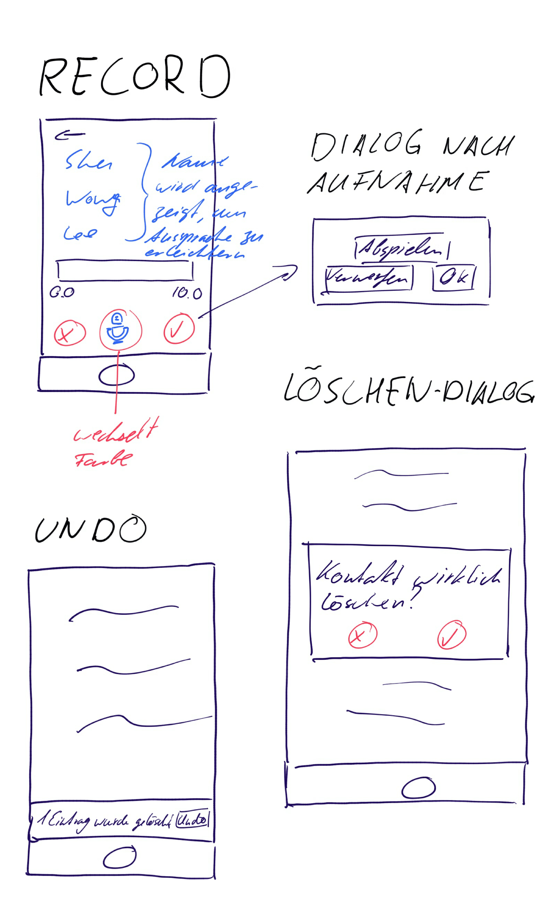

# Einführung

*Dieser Entwurf legt die prinzipielle Lösungsstruktur fest und enthält alles, was man benötigt, um einem Außenstehenden den prinzipiellen Aufbau der App erklären zu können.* (**keep it simple**)

Die ursprüngliche Idee des Entwurfs ware eine Adaptierung des Model-View-Controller Entwurfmusters. 
Weitere Komponenten wurden anschließend hinzugefügt, um einzelne Zuständigkeitsbereiche abzudecken (z.B. Audio).

Die ursprüngliche GUI-Komponente ist in die einzelnen Komponenten MainView (zuständig für die Darstellung der Kontaktliste/Settings/About/..) und ContactView (zuständig für die Erstellung/Bearbeitung/Einsicht von einzelnen Kontakten).
Die ursprüngliche Controller-Komponente wurde in einen allgemeinen DataController ('Schnittstelle' zur SQL-Datenbank), Audio (zuständig für alles hörbare) und ExportImport (zuständig für das Exportieren/Importieren von Daten) aufgeteilt.
Die Model-Komponente besteht aus einer simplen Verwaltungsklasse der SQL-Datenbank.

Verwendete Entwurfsmuster: Model-View-Controller, Singleton

# Komponentendiagramm

## Komponente 1: MainView
Die MainView-Komponente ist zuständig für die Darstellung des ‘Default’-GUIs.
Dies beinhaltet: 
 - Darstellung der Kontaktliste (inkl. filtern/sortieren/suchen)
 - Darstellung des Filters/Sorters
 - Darstellung der Einstellungen
 - Darstellung des About-Teils
 - Zugriff auf die Kontakterstellung

Als GUI-Klasse bietet die Komponente selbst keine Interfaces an, verwendet jedoch:
 - ContactManager aus DataController, um die Kontaktliste mit Daten zu füllen
 - ContactManager aus DataController, um Daten zu löschen (Reset)
 - Import aus ExportImport, um einen Datenimport durchzuführen
 - Export aus ExportImport, um einen Datenexport durchzuführen
 - Filter aus DataController, um den Filter/Sortierer anzupassen

Weiterhin wird von der Komponente MainView, durch Auswahl eines Kontaktes, der Zuständigkeitsbereich von ContactView ausgelöst.  

## Komponente 2: ContactView
Die ContactView ist zuständig für die Darstellung und Verwaltung eines ausgewählten Kontakts.
Diese wird aufgeteilt in zwei GUI-Komponenten. 
 - Die ContactViewerActivity
 - Bessere Übersicht des ausgewählten Kontakts
 - Zugriff auf die Verwaltung des ausgewählten Kontakts

Die NewContactActivity
Möglichkeit zur Verwaltung von
Name/Nachname
Titel
Land
Geschlecht
Aussprache

Die Komponente bietet selbst keine Interfaces an, verwendet jedoch drei externe Interfaces:
 - ContactManager aus DataController: Erstellung/Bearbeitung/Löschen von Kontaktdaten
 - Recorder aus Audio: Aufnehmen einer Aussprache
 - Player aus Audio: Wiedergabe einer Aufnahme

## Komponente 3: DataController
Die DataController-Komponente ist zuständig für die Manipulierung der Datenbank, sowie der Bereitstellung von Daten aus der Datenbank. Die Zuständigkeit beinhaltet:
 - Erstellung eines Kontakteintrages
 - Änderung eines Kontakteintrages
 - Löschung eines Kontakteintrages
 - Bereitstellung eines Cursor mit Daten aus der Datenbank
 - Anwendung und Verwaltung der Filter/Sortier-Einstellungen

Die DataController-Komponente stellt zwei Interfaces verfügbar:
 - ContactManager: Manipulation/Bereitstellung von Daten
 - Filter: Zugriff auf die Filter/Sortier-Einstellungen

Die DataController-Komponente verwendet ein Interface:
 - DBManager aus Datenbank: Um Zugriff auf die SQL-Datenbank zu erhalten  

## Komponente 4: Audio
Mit der Audio-Komponente kann man Audio Dateien
- erstellen
- speichern
- abspielen
- und eine abspielende Datei stoppen.

Sie bietet die Schnittstellen Player (Wiedergabe von Aufnahme) der HomeActivity und der NewContactActivity an, 
sowie die Schnittstelle Recorder (Aufnahme von Aussprache) der NewContactActivity.

## Komponente 5: ExportImport
Die ExportImport-Komponente ist zuständig für das Zippen/Unzippen/Verschieben von Dateien, um diese zu Exportieren/Importieren. 
Die ExportImport-Komponente bietet zwei Interfaces an:
 - Import: Erlaubt es eine Import-Aktion zu starten
 - Export: Erlaubt es eine Export-Aktion zu starten

Die ExportImport-Komponente greift auf ein Interface zu:
 - DBManager aus Datenbank: Um nach dem Importieren von Daten die SQL-Datenbank zu erneuern  

## Komponente 6: Datenbank
Die Komponente Datenbank ist die Datenbank der App. Kontakte sowie alle dazugehörigen Daten werden hier verwaltet.
Die Datenbank stellt den DBManager als Schnittstelle zur Verfügung, welches von ExportImport und DataController verwendet wird. Die Schnittstelle stellt die SQL-Datenbank zur Verfügung.

# Klassendiagramme

## Klassendiagramm Controller

## Klassendiagramm View

## Klassendiagramm Model

# Beschreibung der wichtigen Klassenhierarchie

## ContactManager:
Manipuliert die Kontakt-Datenbank direkt, stellt Daten für den View bereit. 
"Schnittstelle" zwischen Daten und Darstellung. 
Erstellt Kontakte, editiert Kontakte, löscht Kontakte, provided Cursor.

## NewContactActivity:
Android-Activity.
Erlaubt es dem Nutzer Kontakte zu editieren/erstellen. 
Implementiert wichtige Critical Features "Kontakt erstellen", "Kontakt editieren".
Kontakterstellungs / -editierungs-UI.

## HomeActivity:
Android-Activity.
Kern der View-Komponente.
Implementiert wichtige Critical Features "Kontakte dursuchen", "Kontakte einsehen".
Bildet Ankerpunkt für andere Activities.
UI für Suche, Kontaktliste, Settings, Info.

# GUI-Skizze

