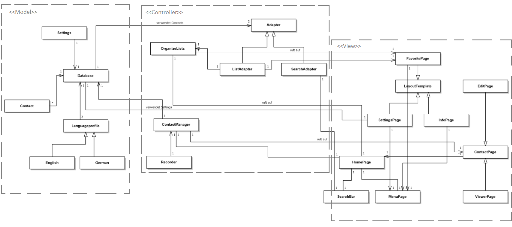

# Einführung

*Dieser Entwurf legt die prinzipielle Lösungsstruktur fest und enthält alles, was man benötigt, um einem Außenstehenden den prinzipiellen Aufbau der App erklären zu können.* (**keep it simple**)

Die Datenbank (Model) liefert den Controller und dem View Informationen. Der Kontroller steuert den Ablauf des Programms. Der View dient zur Darstellung der Daten.

Verwendete Entwurfsmuster: Model-View-Controller, Singleton

# Komponentendiagramm

![Gubaer at the German language Wikipedia [GFDL (http://www.gnu.org/copyleft/fdl.html) or CC-BY-SA-3.0 (http://creativecommons.org/licenses/by-sa/3.0/)], via Wikimedia Commons](sketches/Komponentendiagramm.png)

Gubaer at the German language Wikipedia [GFDL (http://www.gnu.org/copyleft/fdl.html) or CC-BY-SA-3.0 (http://creativecommons.org/licenses/by-sa/3.0/)], via Wikimedia Commons.

## Komponente 1: Model

Datenhaltung von Kontakten, Einstellungen und Sprachprofilen. Providet für View und Controller.

## Komponente 2: Controller

Verwendet von Model bereitgestellte Daten, um den View zu steuern. Kann Daten in Model manipulieren und View kontrollieren.

## Komponente 3: View

Stellt Daten von Model in GUI dar. Schnittstelle zu Nutzer.

## Externe Komponente 1

Material.io/icons

Verwendung in View um Benutzerfreundlichkeit zu fördern.

# Klassendiagramm

# Beschreibung der wichtigen Klassenhierarchie

## Datenbank:
Speichert sämliche Informationen aller Kontakte und sonstige Einstellungen auf dem Gerätespeicher.

## Contact: 
Enthält alle Informationen eines Kontaktes. Informationen werden in der Datenbank permanent gespeichert.

## ContactManager:
Implementiert Critical Features. Verwaltet Daten bezüglich Kontakten über die Datenbank. 

# GUI-Skizze

